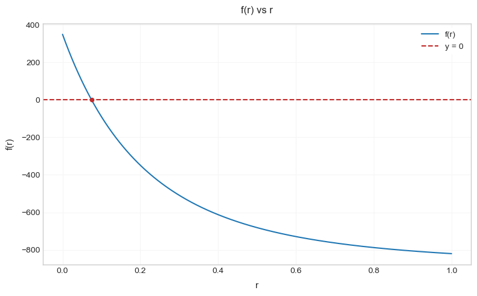
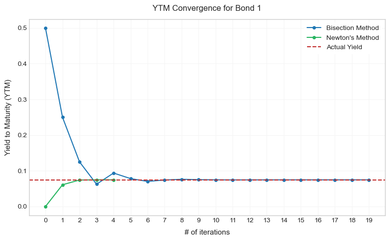

All [bonds](https://en.wikipedia.org/wiki/Bond_(finance)) are not created equal. There may be many differences: The borrowing party may be the US government, or the World Bank, or a company like Apple. The borrowed amount
could be in millions of euros, or billions of dollars. It could be paid back all at the end of 10 years, or
partly every month for 30 years. The lender could have additional options, or the borrower more restrictions.

How can we then compare different bonds? The answer is: using Mathematics. 

Keeping only the most necessary and useful properties, and ignoring the rest: A bond is simply a promise to pay back certain amounts at certain times, and it can be traded in the market for a price.

Now, consider a bond: let $F$ be its face value, $C$ be the coupon payment, $T$ be the time periods to maturity
and $P$ be the market price. Then the yield to maturity $r$ is defined as the interest rate that solves the equation:
$$
\begin{align*}
    P &= \sum_{t=1}^{T} \frac{C}{(1+r)^t} + \frac{F}{(1+r)^T}. \tag*{(1)}
\end{align*}
$$

It is the discount rate which equates the present value of the bond's cash flows to its market price.
This assumes that (1) the bond is held to maturity and (2) the issuer makes the coupon and principal payments as promised.

To think of $r$ as the return on the bond, it is also assumed that (3) the coupons are (or can be) reinvested at the yield:
$$
\begin{align*}
    P(1+r)^T &= \sum_{t=1}^{T} C(1+r)^{T-t} + F. \tag*{(2)}
\end{align*}
$$

The left hand side is the future value of an investment of $P$ at the yield $r$ for $T$ periods, 
and the right hand side is the future value of the cash flows from the bond with reinvestment
of coupons at the yield.

So, at the cost of a few assumptions, a single meaningful number $r$ can be used to compare very different bonds.

All that's left now is actually solving for $r$. Not long after staring at the equations, you might realize the good news and the bad news. There are no weird $\sin$, $\cos$ or $\log$ terms, it's only a polynomial equation. But, unlike the quadratics from high school, it has no general closed-form solutions (formulas).

So, we turn to [Numerical Analysis](https://en.wikipedia.org/wiki/Numerical_analysis). The idea is to keep trying values of $r$ such that: (1) every next attempt is _better_ than the previous one, (2) ultimately the LHS and the RHS are very _close_, if not equal, and (3) all this happens reasonably _fast_.

Two such methods are the _Bisection Method_ and the _Newton's Method_.

Note that solving for $r$ in equation (1) is the same as solving for $r$ in
$$
\begin{align*}
f(r) = \sum_{t=1}^{T} \frac{C}{(1+r)^t} + \frac{F}{(1+r)^T} - P = 0. \tag*{(3)}  
\end{align*}
$$
Also, this $f(r)$ is decreasing in $r$. It looks like:

#### Bisection Method
It's just like binary search. 

Start with $r_1$ and $r_2$ such that
$f(r_1) > 0$ and $f(r_2) < 0$. Then the interval $[r_1, r_2]$ definitely has the root. In this case, easy choices could be $r_1 = 0$ and $r_2 = 1$.

1. Now, check the sign of $f\left(\frac{r_1 + r_2}{2}\right)$.
2. If it's positive, set $r_1:=\frac{r_1 + r_2}{2}$, if it's negative, set $r_2:=\frac{r_1 + r_2}{2}$.
3. Repeat steps 1 and 2 till $\left|f\left(\frac{r_1 + r_2}{2}\right)\right| < \epsilon$.

Here, $\epsilon$ is an error tolerance parameter that needs to be decided by the user.

#### Newton's Method
Since $f''(r) > 0$, $f(r)$ is a [convex](https://en.wikipedia.org/wiki/Convex_function) function. And this can be exploited as follows:
1. Choose a random $r = r_1$, and get the equation of the tangent to $f$ at $r_1$: $y = f(r_1) + f'(r_1)(r - r_1)$.
2. Get the r-intercept of this line; i.e. set $y := 0$: $r_2 = r_1 - \frac{f(r_1)}{f'(r_1)}$.
3. Repeat steps 1 and 2 with $r = r_2$.

Newton's method is much faster (quadratic convergence) than bisection:

&nbsp;

#### Notes